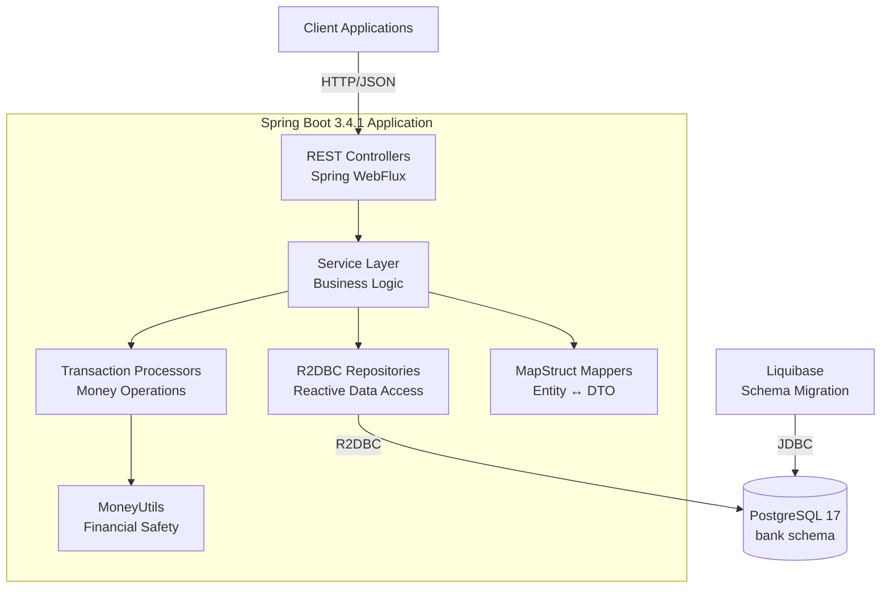
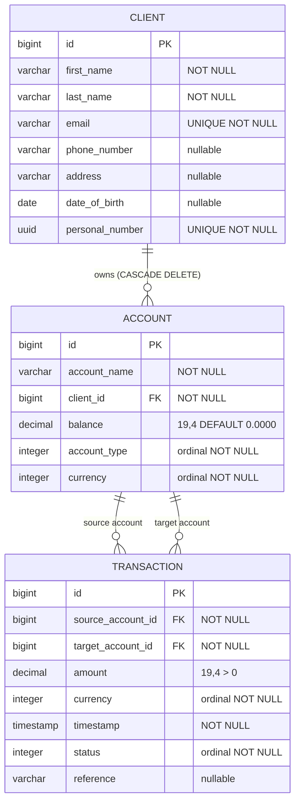
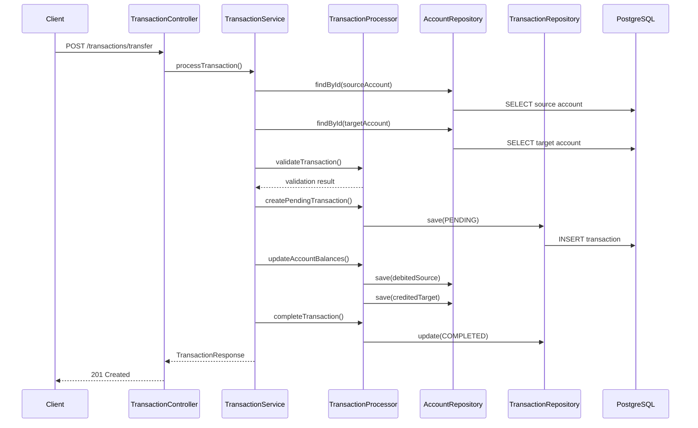

# Minibank v0.5.0

A reactive banking system built with Spring Boot 3.4.1, Kotlin, and R2DBC for high-performance, non-blocking financial operations.

## Architecture Overview



## Domain Model



## Technology Stack

**Core Framework:**
- Spring Boot 3.4.1
- Kotlin 2.1.21
- Spring WebFlux (Reactive Web)
- R2DBC (Reactive Database)

**Database:**
- PostgreSQL 17
- Liquibase (Schema Management)
- Enum Ordinal Storage

**Development:**
- MapStruct 1.6.3 (Bean Mapping)
- Docker & Docker Compose
- Testcontainers (Integration Testing)
- JUnit 5

## Getting Started

### Prerequisites

- JDK 21 or higher
- Docker & Docker Compose
- curl (for testing)

### Quick Start

1. **Start Infrastructure:**
```bash
docker compose up -d postgres
```

2. **Initialize Database Schema:**
```bash
./mvnw liquibase:update
```

3. **Build and Start Application:**
```bash
./mvnw clean bootBuildImage
docker compose up -d app
```

4. **Verify Application:**
```bash
curl http://localhost:8082/actuator/health
```

5. **Run API Tests:**
```bash
./test_minibank_api.sh
```

6. **Shutdown:**
```bash
docker compose down -v  # -v removes volumes/data
```

### Development Mode

```bash
# Start only database
docker compose up -d postgres

# Run schema migrations
./mvnw liquibase:update

# Start application in development
./mvnw spring-boot:run

# Application available at http://localhost:8082
```

## API Reference

### Base URL
```
http://localhost:8082
```

### OpenAPI Documentation
- **OpenAPI Spec**: [openapi.yaml](src/main/resources/openapi.yaml)
- **Swagger UI**: http://localhost:8082/swagger-ui.html (when running)

### Core Endpoints

**Clients:**
- `GET /clients` - List all clients
- `POST /clients` - Create client
- `GET /clients/{id}` - Get client by ID
- `PUT /clients/{id}` - Update client
- `DELETE /clients/{id}` - Delete client
- `GET /clients/search-by-name/{firstName}` - Search by first name
- `GET /clients/search-by-email/{email}` - Search by email

**Accounts:**
- `GET /accounts` - List all accounts
- `POST /accounts` - Create account
- `GET /accounts/{id}` - Get account by ID
- `PUT /accounts/{id}` - Update account
- `DELETE /accounts/{id}` - Delete account
- `GET /accounts/client/{clientId}` - Get client's accounts

**Transactions:**
- `POST /transactions/transfer` - Transfer money
- `GET /transactions/{id}` - Get transaction by ID
- `GET /transactions/account/{accountId}` - Get account transactions
- `GET /transactions/account/{accountId}/outgoing` - Outgoing transactions
- `GET /transactions/account/{accountId}/incoming` - Incoming transactions

### Example Usage

**Create Client:**
```bash
curl -X POST http://localhost:8082/clients \
  -H "Content-Type: application/json" \
  -d '{
    "firstName": "John",
    "lastName": "Doe", 
    "email": "john.doe@example.com",
    "phoneNumber": "+1234567890",
    "address": "123 Main St",
    "dateOfBirth": "1990-01-15"
  }'
```

**Create Account:**
```bash
curl -X POST http://localhost:8082/accounts \
  -H "Content-Type: application/json" \
  -d '{
    "accountType": "CHECKING",
    "balance": "1000.0000",
    "currency": "USD",
    "clientId": 1
  }'
```

**Transfer Money:**
```bash
curl -X POST http://localhost:8082/transactions/transfer \
  -H "Content-Type: application/json" \
  -d '{
    "sourceAccountId": 1,
    "targetAccountId": 2,
    "amount": "250.0000",
    "currency": "USD",
    "reference": "Monthly payment"
  }'
```

## Data Types & Enums

**Account Types:**
`CHECKING`, `CURRENT`, `SAVINGS`, `INVESTMENT`, `BUSINESS`, `STUDENT`, `JOINT`, `LOAN`, `CLASSIC`

**Currencies:**
`USD`, `EUR`, `GBP`

**Transaction Status:**
`PENDING`, `COMPLETED`, `FAILED`

## Money Safety Features

- **4-Decimal Precision**: All amounts stored with `DECIMAL(19,4)`
- **Banker's Rounding**: `HALF_EVEN` rounding mode
- **Validation**: Min amount `0.0001`, max `999,999,999,999,999.9999`
- **MoneyUtils**: Centralized financial calculations
- **Currency Matching**: Enforced across transaction accounts

## Transaction Flow



## Testing

**Unit Tests:**
```bash
./mvnw test
```

**Integration Tests:**
```bash
./mvnw test -Dtest=*IntegrationTest
```

**API Testing:**
```bash
./test_minibank_api.sh
```

**Test Coverage:**
- Controller layer unit tests
- Service layer integration tests
- Repository tests with Testcontainers
- End-to-end API testing

## Project Structure

```
minibank/
├── src/main/kotlin/cz/ememsoft/minibank/
│   ├── api/                    # REST Controllers
│   ├── service/                # Business Logic
│   ├── repository/             # Data Access
│   ├── entity/                 # JPA Entities
│   ├── dto/                    # Data Transfer Objects
│   ├── mapper/                 # MapStruct Mappers
│   ├── enumeration/            # Enums
│   ├── exception/              # Custom Exceptions
│   ├── util/                   # Utilities (MoneyUtils)
│   ├── validation/             # Validation Strategies
│   └── config/                 # Configuration
├── src/main/resources/
│   ├── db/changelog/           # Liquibase Migrations
│   └── application*.yml        # Configuration Files
├── src/test/                   # Test Classes
├── docs/                       # PlantUML Diagrams
├── docker-compose.yml          # Docker Services
└── test_minibank_api.sh        # API Test Script
```

## Configuration

**Database Connection:**
```yaml
spring:
  r2dbc:
    url: r2dbc:postgresql://localhost:5432/minibank-database?currentSchema=bank
    username: postgres
    password: postgres
```

**Liquibase:**
```yaml
spring:
  liquibase:
    change-log: classpath:db/changelog/db.changelog-master.yaml
    default-schema: bank
```

## Monitoring

**Health Check:**
```bash
curl http://localhost:8082/actuator/health
```

**Metrics:**
```bash
curl http://localhost:8082/actuator/metrics
```

## Error Handling

The API provides consistent error responses:

```json
{
  "error": "Insufficient Funds",
  "message": "Insufficient funds in account 1. Available: 100.00 USD, Required: 150.00 USD"
}
```

**Common Error Types:**
- `400` - Validation errors, insufficient funds, currency mismatch
- `404` - Resource not found
- `409` - Duplicate client email
- `500` - Internal server error

## Performance Features

- **Non-blocking I/O**: R2DBC reactive database access
- **Connection Pooling**: Configurable R2DBC connection pool
- **Enum Ordinals**: Integer storage for account types/currencies
- **Efficient Indexing**: Optimized database indexes
- **Async Processing**: Non-blocking transaction processing

## Security Notes

- Input validation on all endpoints
- Email uniqueness enforcement
- Transaction amount limits
- Account balance constraints
- Foreign key integrity

## Troubleshooting

**Database Connection Issues:**
```bash
# Check database status
docker compose logs postgres

# Verify schema
docker compose exec postgres psql -U postgres -d minibank-database -c "\dt bank.*"
```

**Application Issues:**
```bash
# Check application logs
docker compose logs app

# Verify health
curl http://localhost:8082/actuator/health
```

## License

Apache License 2.0 - see LICENSE file for details.

## Contributing

1. Fork the repository
2. Create feature branch (`git checkout -b feature/amazing-feature`)
3. Commit changes (`git commit -m 'Add amazing feature'`)
4. Push to branch (`git push origin feature/amazing-feature`)
5. Open Pull Request