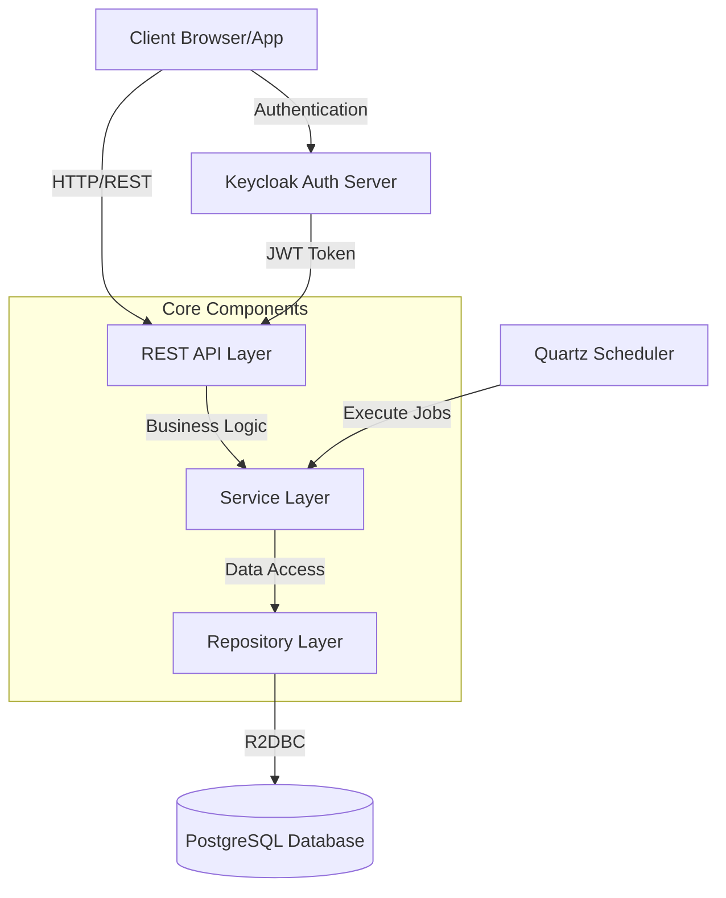
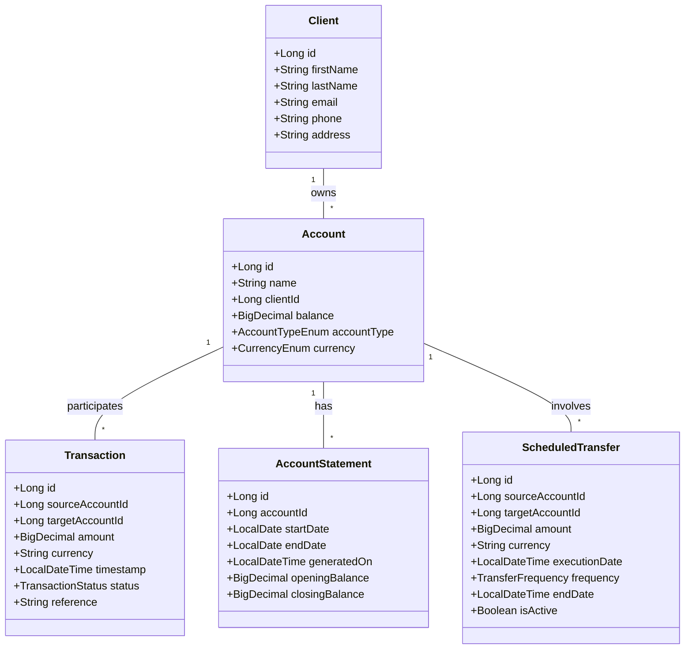
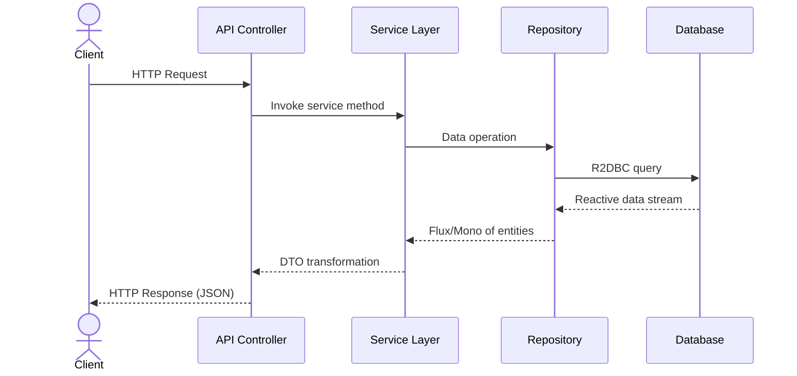

# Minibank v0.5.0

A reactive banking system built with Spring Boot 3.4.1, Kotlin, and R2DBC.

## System Architecture



## Domain Model



## Features

- **Client Management**: Create, update, and manage client information
- **Account Management**: Create and manage different types of bank accounts
- **Transaction Processing**: Transfer money between accounts with real-time balance updates
- **Account Statements**: Generate account statements for specified periods
- **Scheduled Transfers**: Set up one-time or recurring transfers between accounts
- **Security**: OAuth2/OIDC authentication and authorization with fine-grained access control

## Request Flow



For more detailed diagrams, see the PlantUML files in the `/docs` directory:
- [System Architecture](docs/architecture.puml)
- [Domain Model](docs/domain.puml)
- [Money Transfer Sequence](docs/transfer-sequence.puml)

## Technology Stack

- **Kotlin 2.1.10**: Modern, concise JVM language with functional programming features
- **Spring Boot 3.4.1**: Framework for building reactive microservices
- **Spring WebFlux**: Reactive web framework
- **R2DBC**: Reactive database connectivity
- **PostgreSQL**: Relational database
- **Liquibase**: Database schema versioning and migration
- **Quartz**: Advanced scheduling capabilities
- **Spring Security**: Authentication and authorization
- **OAuth2/OIDC**: Modern authentication and authorization protocols
- **Keycloak**: Identity and access management
- **Docker**: Containerization for easy deployment
- **Testcontainers**: Integration testing with real database instances
- **MapStruct**: Type-safe bean mapping
- **JUnit 5**: Testing framework

## Prerequisites

- JDK 23 or higher
- Docker and docker-compose
- Gradle 8.11.1 or higher (or use the included Gradle wrapper)

## Getting Started

### Setup

1. Clone the repository:
   ```bash
   git clone https://github.com/yourusername/minibank.git
   cd minibank
   ```

2. Start the database and Keycloak:
   ```bash
   docker-compose up -d postgres keycloak
   ```

3. Build and run the application:
   ```bash
   ./gradlew clean bootRun
   ```

   Alternatively, build and run with Docker:
   ```bash
   ./gradlew clean bootBuildImage
   docker-compose up -d
   ```

4. Access the application:
   - API: http://localhost:8082
   - Keycloak Admin: http://localhost:8080 (admin/admin)

### Default Users

The application comes with two predefined users:

1. **Admin User**
   - Username: `admin`
   - Password: `admin`
   - Roles: `ADMIN`
   - Scopes: Full access to all endpoints

2. **Regular User**
   - Username: `user`
   - Password: `user`
   - Roles: `USER`
   - Scopes: Read-only access to most endpoints

## API Endpoints

### Client Management
- `GET /clients` - Get all clients
- `GET /clients/{id}` - Get client by ID
- `POST /clients` - Create a new client
- `PUT /clients` - Update a client
- `DELETE /clients/{id}` - Delete a client
- `GET /clients/search-by-name/{firstName}` - Search clients by first name
- `GET /clients/search-by-email/{email}` - Search client by email

### Account Management
- `GET /accounts` - Get all accounts
- `GET /accounts/{id}` - Get account by ID
- `POST /accounts` - Create a new account
- `PUT /accounts/{id}` - Update an account
- `DELETE /accounts/{id}` - Delete an account
- `GET /accounts/client/{clientId}` - Get accounts for client

### Transaction Management
- `POST /transactions/transfer` - Transfer money between accounts
- `GET /transactions/{id}` - Get transaction by ID
- `GET /transactions/account/{accountId}` - Get transactions for account
- `GET /transactions/account/{accountId}/outgoing` - Get outgoing transactions
- `GET /transactions/account/{accountId}/incoming` - Get incoming transactions

### Account Statements
- `POST /statements/{accountId}/generate` - Generate statement for period
- `GET /statements/account/{accountId}` - Get all statements for account
- `GET /statements/{id}` - Get statement by ID
- `GET /statements/account/{accountId}/latest` - Get most recent statement
- `GET /statements/{id}/export/pdf` - Export statement as PDF
- `GET /statements/{id}/export/csv` - Export statement as CSV

### Scheduled Transfers
- `POST /scheduled-transfers` - Create scheduled transfer
- `GET /scheduled-transfers/{id}` - Get transfer by ID
- `GET /scheduled-transfers/account/{accountId}` - Get transfers for account
- `GET /scheduled-transfers/my-transfers` - Get current user's transfers
- `PUT /scheduled-transfers` - Update scheduled transfer
- `DELETE /scheduled-transfers/{id}` - Cancel scheduled transfer

## Development

### Project Structure

```
project/
├── build.gradle.kts            # Build configuration with dependencies
├── docker-compose.yml          # Docker compose for running the application
├── config/
│   └── keycloak/
│       └── minibank-realm.json # Keycloak realm configuration
├── src/
│   ├── main/
│   │   ├── kotlin/            # Kotlin source code
│   │   └── resources/         # Application resources and configurations
│   └── test/
│       ├── kotlin/            # Test code
│       └── resources/         # Test resources
```

### Running Tests

Run unit tests:
```bash
./gradlew test
```

Run integration tests:
```bash
./gradlew integrationTest
```

### Configuration

Configuration properties are in `src/main/resources/application.yml` and environment-specific configurations are in `application-{env}.yml` files.

## Security

The application uses OAuth2/OIDC for authentication and authorization:

- **Authentication**: Users authenticate via Keycloak
- **Authorization**: Access control is based on roles and scopes
- **JWT**: Secure token-based authentication

## License

This project is licensed under the Apache License 2.0 - see the LICENSE file for details.

## Contributing

1. Fork the repository
2. Create your feature branch (`git checkout -b feature/amazing-feature`)
3. Commit your changes (`git commit -m 'Add some amazing feature'`)
4. Push to the branch (`git push origin feature/amazing-feature`)
5. Open a Pull Request